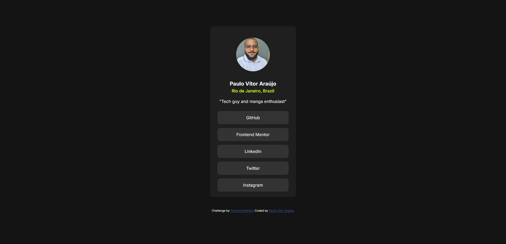

# Frontend Mentor - Social links profile solution

This is a solution to the [Social links profile challenge on Frontend Mentor](https://www.frontendmentor.io/challenges/social-links-profile-UG32l9m6dQ). Frontend Mentor challenges help you improve your coding skills by building realistic projects. 

## Table of contents

- [Overview](#overview)
  - [The challenge](#the-challenge)
  - [Screenshot](#screenshot)
  - [Links](#links)
- [My process](#my-process)
  - [Built with](#built-with)
  - [What I learned](#what-i-learned)
  - [Useful resources](#useful-resources)
- [Author](#author)

## Overview

### The challenge

Users should be able to:

- See hover and focus states for all interactive elements on the page.

### Screenshot

### Links

- Solution URL: [https://social-links-profile-nine.vercel.app/](https://social-links-profile-nine.vercel.app/)

## My process

### Built with

- HTML
- CSS

### What I learned

This is my first time *really* trying to learn how to use CSS properly. Lot of new things and it is going pretty well thus far.

### Useful resources

- [W3Schools](https://www.w3schools.com/) - This helped me understanding and applying some features that were unknown.
- [DevDocs](https://devdocs.io/) - This is an amazing place to read all the documentation needed.

## Author

- Frontend Mentor - [@araujovitorpaulo](https://www.frontendmentor.io/profile/araujovitorpaulo)
- Twitter - [@pvzera_](https://www.twitter.com/pvzera_)
